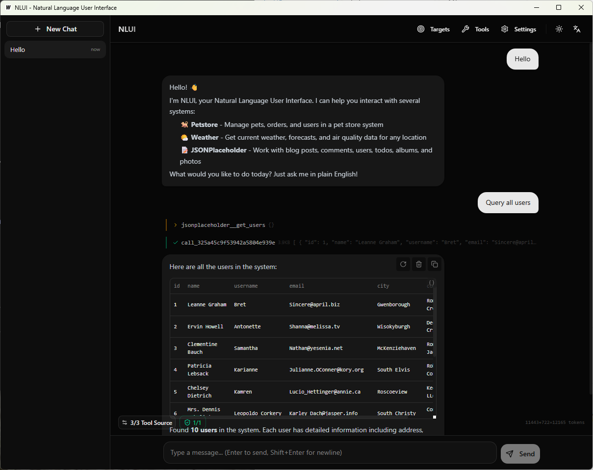

<div align="center">

# NLUI

**Natural Language User Interface**

[](https://github.com/ZacharyZcR/NLUI/actions/workflows/ci.yml)
[](https://go.dev)
[](https://www.typescriptlang.org)
[](LICENSE)
[]()

[中文](README.zh.md) | [Documentation](https://zacharyzcr.github.io/NLUI/)

</div>

---

## The Frontend Problem

For three decades, user interfaces have been stuck in the same loop.

In the **1990s**, we wrote `<form>` tags and server-rendered HTML. Every action was a full page reload. It was primitive, but honest — what you saw was what you got.

The **2000s** brought jQuery and AJAX. We could update parts of a page without reloading. It felt like magic. But underneath, we were still wiring click handlers to API calls, manually shuffling data between the server and the DOM.

Then came the **2010s** — the SPA revolution. React, Vue, Angular. Components, virtual DOM, state management, client-side routing. The frontend became a full application platform. We could build anything.

And we did. We built **everything**.

For every backend endpoint, we designed forms, tables, modals, dropdowns, toast notifications, loading spinners, error boundaries, pagination controls, filter panels, and confirmation dialogs. We wrote thousands of lines of code to translate a simple human intention — *"delete that user"* — into a chain of UI interactions: find the right page, locate the row, click the kebab menu, select "Delete", read the modal, click "Confirm".

By the **2020s**, the frontend ecosystem was mature, powerful, and exhausting. The stack was stable. The DX was polished. But the fundamental problem remained unchanged: **we're still building elaborate graphical middlemen between human intent and API calls.**

What if we skipped the middleman?

## A Different Interface

NLUI takes a different approach. Instead of building custom UI components for every API endpoint, you point NLUI at your OpenAPI spec and get a conversational interface — instantly.

```
User: "Delete user zhangsan"

NLUI: I'll call deleteUser for you.
      [tool_confirm: deleteUser — waiting for approval]

User: [approve]

NLUI: Done. User zhangsan has been deleted.
```

<p align="center">
  
  <br>
  <em>NLUI Desktop with GLM-5 — query all users through natural language</em>
</p>

No forms. No routing. No state management. The user states what they want in natural language, and NLUI figures out which APIs to call, in what order, with what parameters.

This isn't meant to replace every frontend. A data-dense dashboard, a drag-and-drop editor, a real-time collaboration tool — those still need bespoke UI. But for the vast majority of CRUD operations, admin panels, internal tools, and ops workflows that make up the boring bulk of frontend work, **a conversation is a better interface than a form**.

NLUI can be:
- **A replacement** — Deploy it as your entire admin interface
- **An augmentation** — Embed it as a chat widget alongside your existing UI
- **A bridge** — Use it during development before the "real" frontend is built

---

## Features

### Core

- **OpenAPI Auto-Discovery** — Point at your backend. NLUI reads the spec, builds LLM-callable tools automatically. Zero glue code.
- **Streaming Chat (SSE)** — Real-time token-by-token responses. See tool calls and results as they happen.
- **Dangerous Tool Confirmation** — DELETE, PUT, and other destructive operations require explicit user approval before execution.
- **Multi-Target** — Connect multiple backends simultaneously. NLUI routes to the right API based on context.
- **Auth Management** — Per-target authentication (Bearer, API Key, custom header). Tokens persist across sessions.
- **Conversation Persistence** — Full conversation history with edit, delete, and regenerate support.

### Platform

- **HTTP Server** — Gin-based REST API + SSE streaming. Deploy anywhere.
- **Desktop App** — Wails-based native app. One binary, no browser needed.
- **MCP Protocol** — Expose your tools via Model Context Protocol — works with Claude Desktop and any MCP client.
- **Pure TS Engine** — Run entirely in the browser. No Go backend required. LLM calls go directly from the client.

### SDK & UI

- **Multi-Language SDKs** — Go, TypeScript, Python, Java, Rust — call NLUI from any stack.
- **React Components** — Drop-in `<ChatInterface>`, `<SettingsPanel>`, message components with full theming.
- **Vue Components** — Same component library, Vue 3 native.
- **Rich Rendering** — Tables, key-value cards, badge lists — structured data auto-detected and rendered.
- **Engine Adapter** — Use the pure TS engine with the same UI components. No backend, same interface.

### Intelligence

- **Multi-LLM** — Any OpenAI-compatible endpoint — OpenAI, DeepSeek, Ollama, LM Studio, vLLM, Gemini.
- **Context Truncation** — Automatic context window management. Long conversations don't break.
- **Multi-Language Prompts** — System prompts in English, Chinese, and Japanese. Switch at runtime.
- **Tool Filtering** — Per-conversation tool selection. Enable/disable targets and individual tools.
- **Runtime Config** — Change LLM provider, model, stream mode, language — all without restart.

---

## Quick Start

### Install

```bash
go install github.com/ZacharyZcR/NLUI/cmd/nlui@latest

# Or Docker
docker compose up -d
```

### Configure

```bash
cp nlui.example.yaml nlui.yaml
```

```yaml
language: en

llm:
  api_base: http://localhost:11434/v1
  model: qwen2.5:7b

targets:
  - name: my-backend
    base_url: http://localhost:8080
    auth:
      type: bearer
      token: ""

server:
  port: 9000
```

### Run

```bash
go run ./cmd/nlui
```

### Chat

```bash
curl -N http://localhost:9000/api/chat \
  -H "Content-Type: application/json" \
  -d '{"message": "List all users"}'
```

---

## Architecture

```
┌─────────────────────────────────────────────┐
│                   Hosts                     │
│   HTTP Server  ·  Desktop  ·  MCP Server   │
├─────────────────────────────────────────────┤
│                  engine/                    │
├─────────────────────────────────────────────┤
│        core/toolloop  ·  core/llm          │
│           core/conversation                │
├─────────────────────────────────────────────┤
│     gateway/  ·  mcp/  ·  bootstrap/       │
└─────────────────────────────────────────────┘

SDK:  @nlui/client · @nlui/engine · @nlui/react · @nlui/react-ui · @nlui/vue · @nlui/vue-ui
```

## Roadmap

NLUI today is reactive — the user speaks, the system responds. That's just the beginning. The next stages will make it proactive, structured, and self-improving.

### Workflow — Passive Execution Mode

Currently NLUI only acts when spoken to. Workflow mode introduces event-driven pipelines: a webhook fires, a cron triggers, a metric crosses a threshold — and NLUI executes a predefined sequence of tool calls without human input. Same engine, same tools, no conversation required. Turn NLUI from a chatbot into an automation backbone.

### Skill — Guided Tool Orchestration

Raw OpenAPI tools are flat — hundreds of endpoints with no hierarchy. Skills group related tools into named capabilities with structured input schemas and guided flows. Instead of the LLM guessing which 5 endpoints to chain for "deploy staging", a Skill encapsulates that sequence with validation, rollback steps, and contextual prompts. Better than prompt engineering. Closer to programming.

### RAG — Retrieval-Augmented Tool Selection

As the number of tools grows, the LLM's ability to pick the right one degrades. RAG indexes tool descriptions, parameter schemas, and usage examples into a vector store. At query time, only the most relevant tools are injected into context — not all 200. This keeps token usage bounded and selection accuracy high, regardless of how many backends are connected.

### Self-Evolving Memory

The final piece: NLUI learns from its own history. Every conversation is automatically embedded and indexed. When a similar question appears again, the system retrieves past successful tool-call sequences as few-shot examples. No manual prompt tuning, no retraining. The system gets better at its job simply by doing its job. Conversation history becomes a living knowledge base that compounds over time.

---

## Documentation

Full docs at **[zacharyzcr.github.io/NLUI](https://zacharyzcr.github.io/NLUI/)**.

- [Architecture](https://zacharyzcr.github.io/NLUI/guide/architecture)
- [Configuration](https://zacharyzcr.github.io/NLUI/guide/configuration)
- [API Reference](https://zacharyzcr.github.io/NLUI/guide/api)
- [SSE Events](https://zacharyzcr.github.io/NLUI/guide/sse-events)
- [SDK Overview](https://zacharyzcr.github.io/NLUI/sdk/overview)

## License

[MIT](LICENSE)
