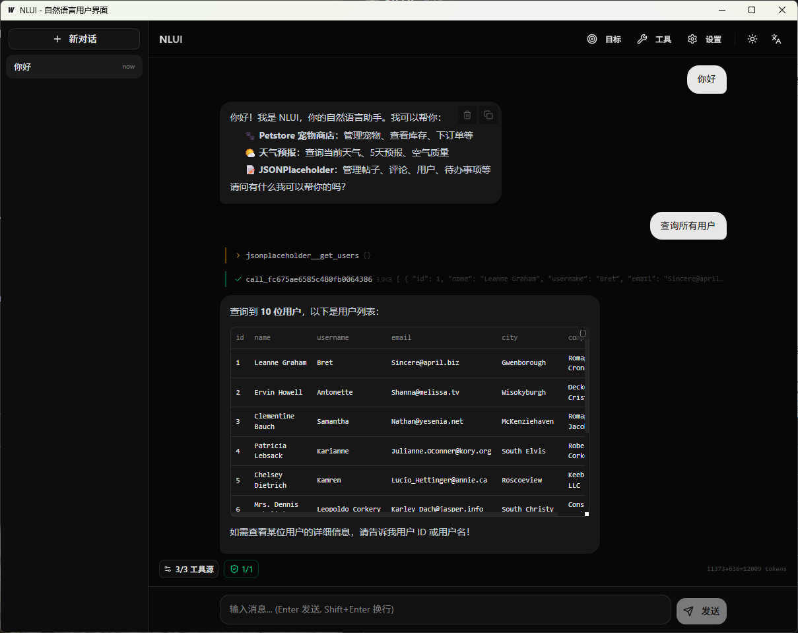

<div align="center">

# NLUI

**Natural Language User Interface**

[](https://github.com/ZacharyZcR/NLUI/actions/workflows/ci.yml)
[](https://go.dev)
[](https://www.typescriptlang.org)
[](LICENSE)
[]()

[English](README.md) | [文档站](https://zacharyzcr.github.io/NLUI/zh/)

</div>

---

## 前端的困局

三十年了，用户界面一直困在同一个循环里。

**1990 年代**，我们写 `<form>` 标签，服务端渲染 HTML。每一次操作都是整页刷新。原始，但诚实——所见即所得。

**2000 年代**，jQuery 和 AJAX 来了。局部更新，不用刷新整页，像魔法一样。但本质上，我们还是在手动把点击事件绑到 API 调用，在服务端和 DOM 之间来回搬运数据。

然后是 **2010 年代**——SPA 革命。React、Vue、Angular。组件化、虚拟 DOM、状态管理、客户端路由。前端成了一个完整的应用平台。我们可以构建任何东西。

然后我们就**真的构建了所有东西**。

每一个后端接口，我们都要设计表单、表格、弹窗、下拉框、Toast 提示、Loading 状态、错误边界、分页控件、筛选面板、确认对话框。我们写了成千上万行代码，就为了翻译一个简单的人类意图——*「删除那个用户」*——变成一连串 UI 交互：找到对应页面，定位那一行，点击更多菜单，选择「删除」，阅读弹窗，点击「确认」。

到了 **2020 年代**，前端生态成熟、强大，也令人疲惫。技术栈稳定了，开发体验打磨好了。但根本问题没有变：**我们仍然在人类意图和 API 调用之间，构建精心设计的图形中间人。**

如果我们跳过中间人呢？

## 一种不同的界面

NLUI 走了另一条路。不再为每个 API 端点构建自定义 UI 组件，而是把 NLUI 指向你的 OpenAPI 文档，立刻获得一个对话式界面。

```
用户: "删除用户 zhangsan"

NLUI: 我将调用 deleteUser 接口。
      [tool_confirm: deleteUser — 等待确认]

用户: [确认]

NLUI: 完成。用户 zhangsan 已被删除。
```

<p align="center">
  
  <br>
  <em>NLUI 桌面端，使用 GLM-5 测试 — 通过自然语言查询所有用户</em>
</p>

没有表单，没有路由，没有状态管理。用户用自然语言说出意图，NLUI 自己判断该调哪些 API、什么顺序、什么参数。

这不是要取代所有前端。数据密集的仪表盘、拖拽编辑器、实时协作工具——这些仍然需要定制 UI。但对于绝大多数 CRUD 操作、后台管理面板、内部工具和运维工作流——那些构成前端工作中最无聊大头的东西——**对话是比表单更好的界面**。

NLUI 可以是：
- **替代方案** — 直接部署为你的全部管理界面
- **增强方案** — 作为聊天组件嵌入现有 UI
- **过渡方案** — 在「正式」前端开发完成之前，先用起来

---

## 功能

### 核心

- **OpenAPI 自动发现** — 指向你的后端，NLUI 自动读取 OpenAPI 文档，构建 LLM 可调用的工具。零胶水代码。
- **流式对话 (SSE)** — 逐 token 实时流式响应，工具调用和结果实时可见。
- **危险操作确认** — DELETE、PUT 等危险操作需要用户明确批准后才执行。
- **多 Target** — 同时连接多个后端，NLUI 根据上下文自动路由到正确的 API。
- **鉴权管理** — 每个 target 独立鉴权（Bearer / API Key / 自定义 Header），token 跨会话持久化。
- **对话持久化** — 完整对话历史，支持编辑、删除、重新生成。

### 平台

- **HTTP 服务** — 基于 Gin 的 REST API + SSE 流式推送，随处部署。
- **桌面应用** — 基于 Wails 的原生桌面应用，单文件，无需浏览器。
- **MCP 协议** — 通过 MCP 协议暴露工具，兼容 Claude Desktop 及任何 MCP 客户端。
- **纯 TS 引擎** — 纯浏览器运行，无需 Go 后端，LLM 调用直接从客户端发出。

### 开发套件

- **多语言 SDK** — Go、TypeScript、Python、Java、Rust — 任意技术栈接入。
- **React 组件** — 开箱即用的 `<ChatInterface>`、`<SettingsPanel>`、消息组件，支持主题定制。
- **Vue 组件** — 同套组件库，Vue 3 原生实现。
- **富渲染** — 表格、键值卡片、标签列表 — 结构化数据自动识别渲染。
- **Engine 适配器** — 纯 TS 引擎复用同一套 UI 组件，无后端，同一接口。

### 智能

- **多 LLM 支持** — 兼容任意 OpenAI 格式端点 — OpenAI、DeepSeek、Ollama、LM Studio、vLLM、Gemini。
- **上下文截断** — 自动上下文窗口管理，长对话不会溢出。
- **多语言提示词** — 系统提示词支持中英日三语，运行时切换。
- **工具筛选** — 每对话工具筛选，按 target 或单个工具粒度开关。
- **运行时配置** — 运行时切换 LLM 提供商、模型、流式模式、语言，无需重启。

---

## 快速开始

### 安装

```bash
go install github.com/ZacharyZcR/NLUI/cmd/nlui@latest

# 或 Docker
docker compose up -d
```

### 配置

```bash
cp nlui.example.yaml nlui.yaml
```

```yaml
language: zh

llm:
  api_base: http://localhost:11434/v1
  model: qwen2.5:7b

targets:
  - name: my-backend
    base_url: http://localhost:8080
    auth:
      type: bearer
      token: ""

server:
  port: 9000
```

### 运行

```bash
go run ./cmd/nlui
```

### 对话

```bash
curl -N http://localhost:9000/api/chat \
  -H "Content-Type: application/json" \
  -d '{"message": "列出所有用户"}'
```

---

## 架构

```
┌─────────────────────────────────────────────┐
│                   宿主层                     │
│   HTTP 服务  ·  桌面应用  ·  MCP 服务       │
├─────────────────────────────────────────────┤
│                  engine/                    │
├─────────────────────────────────────────────┤
│        core/toolloop  ·  core/llm          │
│           core/conversation                │
├─────────────────────────────────────────────┤
│     gateway/  ·  mcp/  ·  bootstrap/       │
└─────────────────────────────────────────────┘

SDK:  @nlui/client · @nlui/engine · @nlui/react · @nlui/react-ui · @nlui/vue · @nlui/vue-ui
```

## 路线图

今天的 NLUI 是被动的——用户说话，系统响应。这只是起点。接下来的几个阶段，将让它变得主动、结构化、自我进化。

### 工作流 — 被动执行模式

目前 NLUI 只在被对话时才行动。工作流模式引入事件驱动的管道：一个 Webhook 触发、一个定时任务到期、一个指标越过阈值——NLUI 自动执行预定义的工具调用序列，无需人类介入。同一个引擎，同一套工具，不需要对话。把 NLUI 从聊天机器人变成自动化引擎。

### Skill — 引导式工具编排

裸 OpenAPI 工具是扁平的——几百个接口，没有层级。Skill 将相关工具组织为命名的能力单元，带结构化输入、引导流程和上下文提示。LLM 不再需要猜测「部署 staging」要调用哪 5 个接口——一个 Skill 封装了整个序列，包含校验、回滚和提示。比 prompt engineering 更好，更接近编程。

### RAG — 检索增强的工具选择

当工具数量增长时，LLM 选对工具的能力会下降。RAG 将工具描述、参数 schema、使用示例索引到向量数据库中。查询时，只有最相关的工具被注入上下文——而不是全部 200 个。无论连接了多少后端，token 开销有界，选择精度不变。

### 自我进化记忆

最后一块拼图：NLUI 从自己的历史中学习。每次对话自动 embedding 并索引。当类似问题再次出现时，系统检索过去成功的工具调用序列作为 few-shot 示例。不需要手动调 prompt，不需要重新训练。系统仅仅因为在工作，就变得更擅长工作。对话历史成为一个随时间复利增长的活知识库。

---

## 文档

完整文档请访问 **[zacharyzcr.github.io/NLUI](https://zacharyzcr.github.io/NLUI/zh/)**。

- [架构](https://zacharyzcr.github.io/NLUI/zh/guide/architecture)
- [配置](https://zacharyzcr.github.io/NLUI/zh/guide/configuration)
- [API 参考](https://zacharyzcr.github.io/NLUI/zh/guide/api)
- [SSE 事件](https://zacharyzcr.github.io/NLUI/zh/guide/sse-events)
- [SDK 概览](https://zacharyzcr.github.io/NLUI/zh/sdk/overview)

## 许可证

[MIT](LICENSE)
